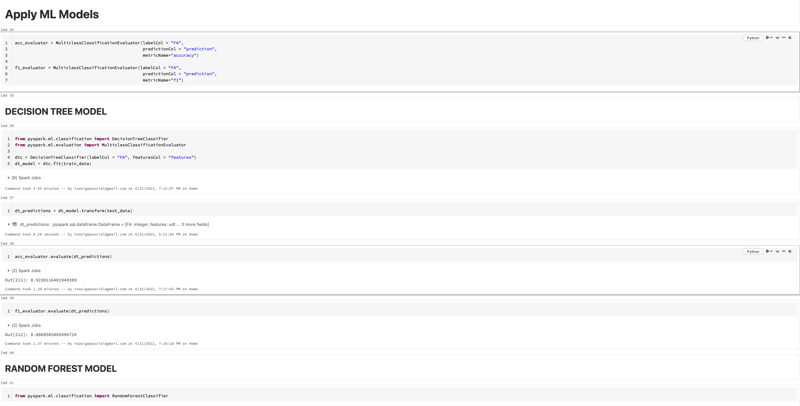

# Machine Learning - SF Fire Department False Alarms

## Project Overview
- Dataset with millions of calls from years 2000-2016
- Prepare data and assemble features for ML models
- Hypertune paramters to compare and select the most accurate model.
- The libraries used were pyspark and numpy
- You can access the Jupiter Notebook at this **[LINK](https://github.com/programTristan/FireDepartment_MachineLearning/blob/3074cd5e9874d3d91880d0dce3f740b6795917e1/code/SF_FireDepartment.ipynb)**

## Objectives 
Design an accurate machine learning model that can be used to predict future false alarms. This will help increase the efficiency of the fire department, detecting false alarms prior to expending resources. 

## Data Preperation
Data is accessed through a public repository on aws s3, uploaded by the government of San Fransisco.

The s3 drive is mounted and tables 'Fire_Department_Call' and 'Fire_Incidents' are extracted. From here, both tables are joined by 'IncidentNumber' creating a single dataframe object. Features are then selected and assembled through the pipeline.

## Data Modeling

4 Different Machine Learning models are constructed and evaluated

- Decision Tree
- Random Forest 
- Linear Regression 
- Logistic Regression

You can access the Jupiter Notebook at this **[LINK](https://github.com/programTristan/FireDepartment_MachineLearning/blob/3074cd5e9874d3d91880d0dce3f740b6795917e1/code/SF_FireDepartment.ipynb)**

## Conclusions
